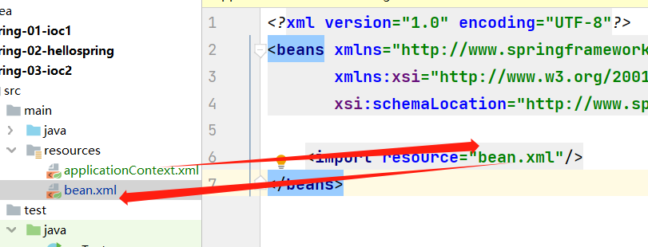
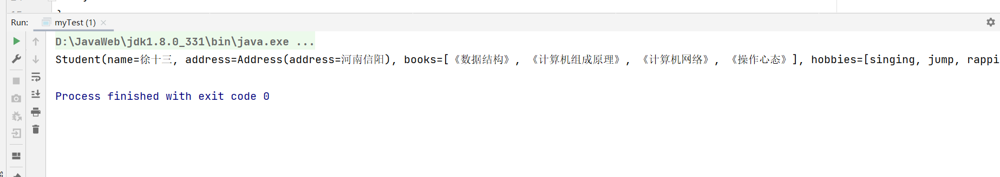
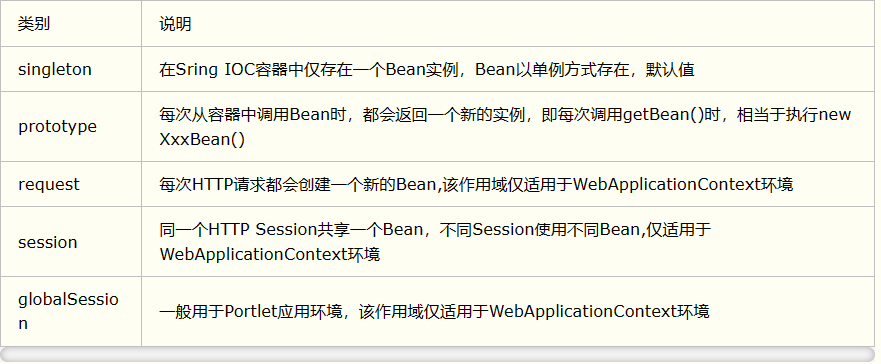

# Spring-Study

## 1.简介

spring理念：使现有的技术更加容易使用，本身是一个大杂烩。

- SSH：Struct2 + Spring + Hibernate
- SSM： SpringMVC + Spring + Mybatis

相关依赖：

  ```
    <!-- https://mvnrepository.com/artifact/org.springframework/spring-webmvc -->
    <dependency>
        <groupId>org.springframework</groupId>
        <artifactId>spring-webmvc</artifactId>
        <version>5.2.5.RELEASE</version>
    </dependency>
    
    <dependency>
        <groupId>org.springframework</groupId>
        <artifactId>spring-jdbc</artifactId>
        <version>5.2.3.RELEASE</version>
    </dependency>

```

- spring是一个开源的免费的容器
- spring是一个轻量级的，非入侵式的。
- 控制反转（IOC），面向切面编程（AOP）
- 支持事务处理，对框架整合的支持

总结：spring是一个轻量级的控制反转和面向切面编程的框架。

## 2.IOC理论

1. UserDao
2. UserDaoImpl
3. UserService
4. UserServiceImpl

在之前，用户的需求可能会影响到原来的代码。使用一个set.

```

public void setUserDao(UserDao userDao){
    this.userDao = userDao;
}
```

- 之前的是主动创建对象，控制权在程序员手上。
- 使用set注入之后，是被动接收对象。

## 3.Hello Spring

- pojo中

```
package com.shisan.pojo;

import lombok.Data;

/**
 * @Author:shisan
 * @Date:2023/10/18 20:45
 */
@Data
public class Student {
    private String name;
}
```

- bean.xml配置

```xml
<?xml version="1.0" encoding="UTF-8"?>
<beans xmlns="http://www.springframework.org/schema/beans"
       xmlns:xsi="http://www.w3.org/2001/XMLSchema-instance"
       xsi:schemaLocation="http://www.springframework.org/schema/beans
        http://www.springframework.org/schema/beans/spring-beans.xsd">
    <!--使用Spring来创建对象，这些都成为bean
     类型 变量名 = new 变量();
      id = 变量名
      class = new 的对象：
      property 相当于给对象的属性设置一个值

    -->
    <bean id="student" class="com.shisan.pojo.Student">
        <property name="name" value="十三"/>
    </bean>
</beans>

```

- StudentApplication类

```java
package com.shisan;

import com.shisan.pojo.Student;
import org.springframework.context.ApplicationContext;
import org.springframework.context.support.ClassPathXmlApplicationContext;

/**
 * @Author:shisan
 * @Date:2023/10/18 20:53
 */
public class StudentApplication {
    public static void main(String[] args) {
        // 获取spring的上下文对象
        ApplicationContext context = new ClassPathXmlApplicationContext("bean.xml");
        // 我们的对象都在spring中管理了
        Student student = (Student) context.getBean("student");
        System.out.println(student.toString());
    }
}
```

bean = 对象 id= 变量名 class = new的对象 property相当于给对象中的属性设值

**核心用set注入**

## 4.IOC创建对象的方式

1.使用无参构造创建对象，默认

```xml

<bean id="user" class="com.shisan.pojo.User">
    <property name="name" value="十三"/>
</bean>
```

2.使用有参构造

- 下标赋值

```xml
<!--第一种使用下标赋值-->
<bean id="user" class="com.shisan.pojo.User">
    <constructor-arg index="0" value="徐十三学Spring"/>
</bean>
```

- 类型赋值（不建议使用）

```xml
<!--第二种通过类型赋值 （不建议使用）-->
<bean id="user" class="com.shisan.pojo.User">
    <constructor-arg type="java.lang.String" value="徐磊"/>
</bean>
```

- 参数名赋值

```xml
<!--第三种使用参数名赋值-->
<bean id="user" class="com.shisan.pojo.User">
    <constructor-arg name="name" value="十三"/>
</bean>
```

总结：在配置文件加载的时候，容器中管理的对象就已经初始化了！！！

## 5.Spring配置

- 别名：

```xml
<!--别名，如果添加了别名，我们可以使用别名获取对象-->
<alias name="user" alias="user2"/>
```

- Bean的配置信息

1. id ：bean 的唯一标识没就是相当于学的对象名
2. class ： bean 对象所对应的全限定名： 包名 + 类名
3. name ： 也就是别名，而且name可以给取多个别名

```xml
<!--bean的配置-->
<bean id="user" class="com.shisan.pojo.User" name="user1 user2 user3 user4">
    <constructor-arg name="name" value="十三"/>
</bean>
```

- import

一般用于团队开发，它可以将多个配置文件，导入合并为一个 在applicationContext.xml中
~~~~

  ```xml

<import resource="beans.xml"/>
  ```

## 6.DI依赖注入

**构造器注入**

**set方式注入**（重点）

- 依赖：bean对象的创建依赖于容器
- 注入：bean对象中的所有属性，由容器来注入

**【环境搭建】**

1.复杂类型

2.真实测试对象

```java
package com.shisan.pojo;

import lombok.AllArgsConstructor;
import lombok.Data;
import lombok.NoArgsConstructor;

import java.util.List;
import java.util.Map;
import java.util.Properties;
import java.util.Set;

/**
 * @Author:shisan
 * @Date:2023/10/19 14:31
 */
@Data
@AllArgsConstructor
@NoArgsConstructor
public class Student {
    private String name;
    private Address address;
    private String[] books;
    private List<String> hobbies;
    private Map<String, String> card;
    private Set<String> games;
    private String wife;
    private Properties info;
}
```

```java
package com.shisan.pojo;

import lombok.Data;

/**
 * @Author:shisan
 * @Date:2023/10/19 14:31
 */
@Data
public class Address {
    private String address;
}

```

```xml
<?xml version="1.0" encoding="UTF-8"?>
<beans xmlns="http://www.springframework.org/schema/beans"
       xmlns:xsi="http://www.w3.org/2001/XMLSchema-instance"
       xsi:schemaLocation="http://www.springframework.org/schema/beans http://www.springframework.org/schema/beans/spring-beans.xsd">
    <!--普通注入-->
    <bean id="address" class="com.shisan.pojo.Address">
        <property name="address" value="河南信阳"/>
    </bean>

    <bean id="student" class="com.shisan.pojo.Student">
        <property name="name" value="徐十三"/>
        <!--Bean注入，ref-->
        <property name="address" ref="address"/>

        <!--数组-->
        <property name="books">
            <array>
                <value>《数据结构》</value>
                <value>《计算机组成原理》</value>
                <value>《计算机网络》</value>
                <value>《操作心态》</value>
            </array>
        </property>

        <!--list-->
        <property name="hobbies">
            <list>
                <value>singing</value>
                <value>jump</value>
                <value>rapping</value>
                <value>basketball</value>
            </list>
        </property>

        <!--map-->
        <property name="card">
            <map>
                <entry key="eat" value="吃排骨"></entry>
                <entry key="sleep" value="睡大觉"></entry>
            </map>
        </property>

        <!--set-->
        <property name="games">
            <set>
                <value>王者荣耀</value>
                <value>部落冲突</value>
                <value>金铲铲</value>
            </set>
        </property>

        <!--null-->
        <property name="wife">
            <null/>
        </property>

        <!--info-->
        <property name="info">
            <props>
                <prop key="学号">022300200240</prop>
                <prop key="班级">20级软件工程2班</prop>
                <prop key="性别">男</prop>
            </props>
        </property>
    </bean>


</beans>
```

```java
import com.shisan.pojo.Student;
import org.springframework.context.ApplicationContext;
import org.springframework.context.support.ClassPathXmlApplicationContext;

/**
 * @Author:shisan
 * @Date:2023/10/19 14:37
 */
public class myTest {
    public static void main(String[] args) {
        ApplicationContext context = new ClassPathXmlApplicationContext("beans.xml");
        Student student = (Student) context.getBean("student");
        System.out.println(student.toString());
    }
}

```

打印的结果

```java
/*
Student(name=徐十三, address=Address(address=河南信阳),
books=[《数据结构》, 《计算机组成原理》, 《计算机网络》, 《操作心态》],
hobbies=[singing, jump, rapping, basketball], card={eat=吃排骨, sleep=睡大觉},
games=[王者荣耀, 部落冲突, 金铲铲], wife=null,
info={学号=022300200240, 性别=男, 班级=20级软件工程2班})
 */
```


**第三方**

p命名标签和c命名标签

- 实体类User

```java
package com.shisan.pojo;

import lombok.AllArgsConstructor;
import lombok.Data;
import lombok.NoArgsConstructor;

/**
 * @Author:shisan
 * @Date:2023/10/19 15:49
 */
@Data
@AllArgsConstructor
@NoArgsConstructor
public class User {
    private String name;
    private Integer age;
}

```

- userBean.xml配置

```xml
<?xml version="1.0" encoding="UTF-8"?>
<beans xmlns="http://www.springframework.org/schema/beans"
       xmlns:xsi="http://www.w3.org/2001/XMLSchema-instance"
       xmlns:p="http://www.springframework.org/schema/p"
       xmlns:c="http://www.springframework.org/schema/c"
       xsi:schemaLocation="http://www.springframework.org/schema/beans
       http://www.springframework.org/schema/beans/spring-beans.xsd">
    <!--p命名空间注入 可以直接注入属性的值-->
    <bean id="user" class="com.shisan.pojo.User" p:name="徐磊" p:age="22"/>
    <!--c命名空间注入，通过构造器注入，construct-args -->
    <bean id="user2" class="com.shisan.pojo.User" c:name="徐十三" c:age="20"/>

</beans>
```

- 测试

```
@Test
public void userTest(){
   ApplicationContext context=new ClassPathXmlApplicationContext("userBean.xml");
   //  User user = (User) context.getBean("user");
   User user=context.getBean("user2",User.class); // 显示的声明对象类型，就不用强转
   System.out.println(user);
}
```

**注意:** p命名和c命名需要导入xml约束

```
xmlns:p="http://www.springframework.org/schema/p"
xmlns:c="http://www.springframework.org/schema/c"

```

**Bean的作用域**

1.单例模式（Spring默认）

```xml

<bean id="user2" class="com.shisan.pojo.User" c:name="徐十三" c:age="20" scope="singleton"/>
```

2.原型模式：每次从容器中get的时候，都产生一个新对象！

```xml

<bean id="user2" class="com.shisan.pojo.User" c:name="徐十三" c:age="20" scope="prototype"/>
```

3.其余的request、session、application这些只能在web开发中使用！

## 7.Bean的自动装配

- 自动装配是Spring的满足bean依赖的一种方式
- Spring会在上下文自动寻找，并自动给bean装配属性

在Spring中有3中装配的方式

1、xml中显示的通过bean的来注入**

```xml

<bean id="cat" class="com.shisan.pojo.Cat"/>
<bean id="dog" class="com.shisan.pojo.Dog"/>

<bean id="people" class="com.shisan.pojo.People">
<property name="name" value="十三"/>
<property name="cat" ref="cat"/>
<property name="dog" ref="dog"/>
</bean>
```

2、Java中显示配置

**byName:**

```xml

<bean id="cat" class="com.shisan.pojo.Cat"/>
<bean id="dog" class="com.shisan.pojo.Dog"/>

<bean id="people" class="com.shisan.pojo.People" autowire="byName">
<property name="name" value="十三"/>
</bean>

```

**byType**

```xml

<bean class="com.shisan.pojo.Cat"/>
<bean class="com.shisan.pojo.Dog"/>

        <!--
        byName：会自动在容器中寻找和Set中注入的对象名和所有唯一id中的值相等的bean
        byType：会自动在容器中寻找和Set中注入的类型和相等的bean
        -->
<bean id="people" class="com.shisan.pojo.People" autowire="byType">
<property name="name" value="十三"/>

</bean>
```

- 小结：

  1.byName的时候，需要确保所有的bean的id唯一，并且这个bean需要和自动自动注入的属性的set方法的值一致。

  2.byName的时候，需要确保所有的bean的class唯一，并且这个bean需要和自动自动注入的属性的set方法的类型一致。

```java
/**
 * @Author:shisan
 * @Date:2023/10/23 15:31
 */
public class Cat {
    public void shout() {
        System.out.println("我们一起学猫叫，喵喵喵……");
    }
}
```

```java

/**
 * @Author:shisan
 * @Date:2023/10/23 15:32
 */
public class Dog {
    public void shout() {
        System.out.println("汪疯唱歌……");
    }
}
```

```java
import lombok.AllArgsConstructor;
import lombok.Data;
import lombok.NoArgsConstructor;

/**
 * @Author:shisan
 * @Date:2023/10/23 15:33
 */
@Data
@AllArgsConstructor
@NoArgsConstructor
public class People {
    private Dog dog;
    private Cat cat;
    private String name;
}
```

```xml
<?xml version="1.0" encoding="UTF-8"?>
<beans xmlns="http://www.springframework.org/schema/beans"
       xmlns:xsi="http://www.w3.org/2001/XMLSchema-instance"
       xsi:schemaLocation="http://www.springframework.org/schema/beans
       http://www.springframework.org/schema/beans/spring-beans.xsd">
    <!--byType-->
    <bean class="com.shisan.pojo.Cat"/>
    <bean class="com.shisan.pojo.Dog"/>

    <!--
    byName
    <bean id="cat" class="com.shisan.pojo.Cat"/>
    <bean id="dog" class="com.shisan.pojo.Dog"/>
    -->
    <!--
    byName：会自动在容器中寻找和Set中注入的对象名和所有唯一id中的值相等的bean
    byType：会自动在容器中寻找和Set中注入的类型和相等的bean
    -->
    <bean id="people" class="com.shisan.pojo.People" autowire="byType">
        <property name="name" value="十三"/>

    </bean>

</beans>
```

**使用注解实现装配**

导入context约束

```xml
<?xml version="1.0" encoding="UTF-8"?>
<beans xmlns="http://www.springframework.org/schema/beans"
       xmlns:xsi="http://www.w3.org/2001/XMLSchema-instance"
       xmlns:context="http://www.springframework.org/schema/context"
       xsi:schemaLocation="http://www.springframework.org/schema/beans
        https://www.springframework.org/schema/beans/spring-beans.xsd
        http://www.springframework.org/schema/context
        https://www.springframework.org/schema/context/spring-context.xsd">

    <context:annotation-config/>

</beans>
```

**@Autowired**

这个属性上使用，也可以用在set上使用

```java
/**
 * @Author:shisan
 * @Date:2023/10/23 15:33
 */
@Data
@AllArgsConstructor
@NoArgsConstructor
public class People {
    @Autowired
    private Dog dog;
    @Autowired
    private Cat cat;
    private String name;
}
```

    @Nullalbe 字段标志的注解，说明该字段可为null

如果@Autowird自动装配环境比较复杂，有多个id和class的对象bean。自动装配无法通过一个注解完成的时候。 可以使用@Qualifier(value= ”dagXX“ )来配合使用，指定唯一的id对象

```java
import lombok.AllArgsConstructor;
import lombok.Data;
import lombok.NoArgsConstructor;
import org.springframework.beans.factory.annotation.Autowired;
import org.springframework.beans.factory.annotation.Qualifier;

/**
 * @Author:shisan
 * @Date:2023/10/23 15:33
 */
@Data
@AllArgsConstructor
@NoArgsConstructor
public class People {
    @Autowired
    @Qualifier(value = "dog22")
    private Dog dog;
    @Autowired
    @Qualifier(value = "cat1")
    private Cat cat;
    private String name;
}

```

@Resource(name="dogXX")也可以使用
**小结：**@Resource和@Autowired的区别

- 都是用来自动装配的，都可以放在属性字段上
- @Autowired通过byType的方式实现，而且必须要求这个对象存在。
- @Resource 默认是通过byName的方式实现的，通过找不到名字，就会按照byType来实现！两者都不就报错
- 执行顺序的不同：@Autowired是通过byType的方式实现，@Resource是通过byName的方式实现

## 8.使用注解开发

在spring4之后，必须要保证有aop的导入包

```xml

<dependency>
    <groupId>org.springframework</groupId>
    <artifactId>spring-webmvc</artifactId>
    <version>5.3.29</version>
</dependency>
```

在使用注解的时候需要在xml中添加context的约束

```xml
<?xml version="1.0" encoding="UTF-8"?>
<beans xmlns="http://www.springframework.org/schema/beans"
       xmlns:xsi="http://www.w3.org/2001/XMLSchema-instance"
       xmlns:context="http://www.springframework.org/schema/context"
       xsi:schemaLocation="http://www.springframework.org/schema/beans
       http://www.springframework.org/schema/beans/spring-beans.xsd
       http://www.springframework.org/schema/context
       https://www.springframework.org/schema/context/spring-context.xsd">

    <!--指定要扫面的包，这些包下的注解就会生效-->
    <context:component-scan base-package="com.shisan"/>

    <context:annotation-config/>
</beans>
```

- 1、属性的注入

```java
/**
 * @Author:shisan
 * @Date:2023/10/24 7:58
 */
// @Component相当于 <bean id = "user" class = "com.shisan.pojo.User"> 完成自动装配
@Component
@Scope("singleton") // 作用域注解singleton or prototype
public class User {
    //    public String name = "徐十三";
    @Value("徐十三") // 相当于<property name="name" value="徐十三"
    public String name;
}
```

- 2、衍生的注解 @Component有几个衍生注解，针对不同的层来分。
    - dao ---@Repository
    - service ---@Service
    - controller ---@Controller

这四个注解功能一样，都是代表将某个类注入到容器中

- 3、作用域@Scope("singleton")

```java
/**
 * @Author:shisan
 * @Date:2023/10/24 7:58
 */
// @Component相当于 <bean id = "user" class = "com.shisan.pojo.User"> 完成自动装配
@Component
@Scope("singleton") // 作用域注解singleton or prototype
public class User {
    //    public String name = "徐十三";
    @Value("徐十三") // 相当于<property name="name" value="徐十三"
    public String name;
}

```

**小结：**

xml与注解

- xml更加万能，维护简单
- 注解不是同类型的对象使用不了，维护复杂。

最佳的配合实践：

- xml用来管理bean
- 注解用来完成属性的注入

```xml
    <!--指定要扫面的包，这些包下的注解就会生效-->
<context:component-scan base-package="com.shisan"/>
<context:annotation-config/>
```

## 9.Java方式配置Spring

JavaConfig Spring的一个子项目，在spring4之后，成为核心功能

配置类

```java
/**
 * @Author:shisan
 * @Date:2023/10/24 15:30
 */
// 这个也是Spring容器托管，注册到容器中，本身也是一个@component
// @Configuration代表这是一个配置类，相当于bean.xml
@Configuration
@ComponentScan("com.shisan.pojo")
public class UserConfig {
    /*
     * 注册一个bean，等价于xml中的bean标签
     * 方法的名字，等价于bean标签中的id
     * 返回值，等价于bean中的class
     * */
    @Bean
    public User user() {
        return new User();  // 要注入到容器中的对象
    }
}
```

实体类

```java
/**
 * @Author:shisan
 * @Date:2023/10/24 15:29
 */
@Data
public class User {
    @Value("徐十三")
    private String name;
}
```

测试类

```java
/**
 * @Author:shisan
 * @Date:2023/10/24 15:33
 */
public class myTest {
    @Test
    public void test() {
        // 使用config完全取代了xml的方式，通过配置类的class对象加载！
        ApplicationContext context = new AnnotationConfigApplicationContext(UserConfig.class);
        User user = context.getBean("user", User.class);
        System.out.println(user.toString());
    }
}
```

这种纯java配置方式

## 10.代理模式

**代理分类：**

- 动态代理
- 静态代理

### 静态代理

**角色分析：** 租房为例子

- 抽象角色：一般会使用接口或者抽象类来解决（租房）

```java
/**
 * @Author:shisan
 * @Date:2023/10/24 16:46
 */
// 租房子的功能
public interface Rent {
    public void rent();
}
```

- 真实角色：被代理的角色（房东）

```java
/**
 * @Author:shisan
 * @Date:2023/10/24 16:45
 */
public class Host implements Rent {
    @Override
    public void rent() {
        System.out.println("房东太太出租房子");
    }
}
```

- 代理角色：代理真实角色，代理后增加一些附属操作(中介)

```java

@Data
@NoArgsConstructor
@AllArgsConstructor
public class Proxy implements Rent {
    private Host host;

    @Override
    public void rent() {
        host.rent();
        before();
        seeing();
        after();
    }

    public void before() {
        System.out.println("中介带你看房子");
    }

    public void seeing() {
        System.out.println("中介带你签合同");

    }

    public void after() {
        System.out.println("中介收租赁金");
    }

}
```

- 客户：访问代理对象的人(租户)

```java
/**
 * @Author:shisan
 * @Date:2023/10/24 16:46
 */
public class Client {
    public static void main(String[] args) {
        Proxy proxy = new Proxy(new Host());
        proxy.rent();
    }
}
```

**代理模式的好处：**

- 可以使真实角色的操作更加纯粹，不需要去关注一些公共的业务

- 公共业务交给代理角色,实现了业务的分工
- 公共业务发生拓展的时候，方便集中管理

**代理模式的缺点：**

- 一个真实的角色会产出一个代理角色，代码量会增加翻倍~开发效率低

### 动态代理

动态代理和静态代理角色一样，不过动态代理类是动态生成的，通过反射

_动态代理：_

- 基于接口：JDK的动态代理【使用】
- 基于类：cglib
- Java字节码

InvocationHandler
**Proxy**

```java
import java.lang.reflect.InvocationHandler;
import java.lang.reflect.Method;
import java.lang.reflect.Proxy;

/**
 * @Author:shisan
 * @Date:2023/10/26 14:15
 */
public class ProxyAgency {
    public static Object createProxy(Object client) {
        return Proxy.newProxyInstance(
                client.getClass().getClassLoader(),
                client.getClass().getInterfaces(),
                new InvocationHandler() {
                    @Override
                    public Object invoke(Object proxy, Method method, Object[] args) throws Throwable {
                        System.out.println("中介：开始处理房租交易。");
                        Object result = method.invoke(client, args);
                        System.out.println("中介：房租交易完成。");
                        return result;
                    }
                }
        );
    }
}
```

**Tenant**

```java

/**
 * @Author:shisan
 * @Date:2023/10/26 10:57
 */
// 租户类
public class Tenant implements Renter {
    @Override
    public void rentHouse() {
        System.out.println("租户：我需要一套公寓.");
    }
}
```

**HouseOwner**

```java
/**
 * @Author:shisan
 * @Date:2023/10/26 10:58
 */
// 房东类
public class HouseOwner implements Landlord {
    @Override
    public void provideHouse() {
        System.out.println("房东：我有一套公寓出租。");
    }
}
```

**Main**

```java
/**
 * @Author:shisan
 * @Date:2023/10/26 11:05
 */
public class Main {
    public static void main(String[] args) {
        Tenant tenant = new Tenant();
        Landlord landlord = new HouseOwner();

        Renter renter = (Renter) ProxyAgency.createProxy(tenant);
        Landlord rentalAgencyForLandlord = (Landlord) ProxyAgency.createProxy(landlord);

        renter.rentHouse();
        rentalAgencyForLandlord.provideHouse();

    }
}
```

## 11.AOP

导入相关aop依赖

```xml

<dependency>
    <groupId>org.aspectj</groupId>
    <artifactId>aspectjweaver</artifactId>
    <version>1.9.19</version>
</dependency>
```

### spring API接口

**applicationContext.xml**

```xml
<?xml version="1.0" encoding="UTF-8"?>
<beans xmlns="http://www.springframework.org/schema/beans"
       xmlns:xsi="http://www.w3.org/2001/XMLSchema-instance" xmlns:aop="http://www.springframework.org/schema/aop"
       xsi:schemaLocation="http://www.springframework.org/schema/beans
        http://www.springframework.org/schema/beans/spring-beans.xsd http://www.springframework.org/schema/aop https://www.springframework.org/schema/aop/spring-aop.xsd">

    <!--注册bean-->
    <bean id="userService" class="com.shisan.service.UserServiceImpl"/>
    <bean id="log" class="com.shisan.log.Log"/>
    <bean id="afterLog" class="com.shisan.log.AfterLog"/>
    <!--
    方式一：使用spring API接口
    配置aop：需要导入aop约束
    -->
    <aop:config>
        <!--切入点：expression：表达式 execution（要执行的位置！ * * * * *）-->
        <aop:pointcut id="pointcut" expression="execution(* com.shisan.service.UserServiceImpl.*(..))"/>

        <!--执行环绕增加-->
        <aop:advisor advice-ref="log" pointcut-ref="pointcut"/>
        <aop:advisor advice-ref="afterLog" pointcut-ref="pointcut"/>
    </aop:config>

</beans>
```

**Log**

```java
import org.springframework.aop.MethodBeforeAdvice;

import java.lang.reflect.Method;

/**
 * @Author:shisan
 * @Date:2023/10/26 15:02
 */
public class Log implements MethodBeforeAdvice {
    /**
     * @param method 要执行的目标对象的方法
     * @param args   参数
     * @param target 目标对象
     * @throws Throwable
     */
    @Override
    public void before(Method method, Object[] args, Object target) throws Throwable {
        System.out.println(target.getClass().getName() + "的" + method.getName() + "被执行了");
    }
}
```

**AfterLog**

```java
import org.springframework.aop.AfterReturningAdvice;

import java.lang.reflect.Method;

/**
 * @Author:shisan
 * @Date:2023/10/26 15:07
 */
public class AfterLog implements AfterReturningAdvice {
    @Override
    public void afterReturning(Object returnValue, Method method, Object[] args, Object target) throws Throwable {
        System.out.println("执行了" + method.getName() + "方法，返回结果为" + returnValue);
    }
}
```

**UserServiceImpl**

```java
/**
 * @Author:shisan
 * @Date:2023/10/26 15:00
 */
public class UserServiceImpl implements UserService {
    @Override
    public void add() {
        System.out.println("增加用户");
    }

    @Override
    public void delete() {
        System.out.println("删除用户");
    }

    @Override
    public void update() {
        System.out.println("更新用户信息");
    }

    @Override
    public void find() {
        System.out.println("查询用户");
    }
}
```

**Main**

```java
import com.shisan.service.UserService;
import org.springframework.context.ApplicationContext;
import org.springframework.context.support.ClassPathXmlApplicationContext;

/**
 * @Author:shisan
 * @Date:2023/10/26 15:35
 */
public class Main {
    public static void main(String[] args) {
        ApplicationContext context = new ClassPathXmlApplicationContext("applicationContext.xml");
        // 动态代理的是接口
        UserService userService = (UserService) context.getBean("userService");
        userService.add();
    }
}
```

### 自定义实现AOP【主要是切面定义】

**DidPointCut**

```java
/**
 * @Author:shisan
 * @Date:2023/10/26 16:16
 */
public class DiyPointCut {
    public void before() {
        System.out.println("=======执行前=======");
    }

    public void after() {
        System.out.println("=======执行后=======");
    }
}
```

**applicationContext.xml**

```xml
<?xml version="1.0" encoding="UTF-8"?>
<beans xmlns="http://www.springframework.org/schema/beans"
       xmlns:xsi="http://www.w3.org/2001/XMLSchema-instance" xmlns:aop="http://www.springframework.org/schema/aop"
       xsi:schemaLocation="http://www.springframework.org/schema/beans
        http://www.springframework.org/schema/beans/spring-beans.xsd http://www.springframework.org/schema/aop https://www.springframework.org/schema/aop/spring-aop.xsd">

    <!--注册bean-->
    <bean id="userService" class="com.shisan.service.UserServiceImpl"/>
    <bean id="log" class="com.shisan.log.Log"/>
    <bean id="afterLog" class="com.shisan.log.AfterLog"/>
    <!--方式二：自定义类-->
    <bean id="diy" class="com.shisan.diy.DiyPointCut"/>
    <aop:config>
        <!--自定义切面 ref 要引用的类-->
        <aop:aspect ref="diy">
            <!--切入点-->
            <aop:pointcut id="point" expression="execution(* com.shisan.service.UserServiceImpl.*(..))"/>
            <!--通知-->
            <aop:before method="before" pointcut-ref="point"/>
            <aop:after method="after" pointcut-ref="point"/>
        </aop:aspect>
    </aop:config>
</beans>
```

## 12.整合Mybatis

帮助文档：https://mybatis.org/spring/zh/

### 回顾Mybatis

**Maven依赖**

```xml

<dependencies>
    <dependency>
        <groupId>junit</groupId>
        <artifactId>junit</artifactId>
        <version>4.13.2</version>
        <scope>test</scope>
    </dependency>

    <dependency>
        <groupId>mysql</groupId>
        <artifactId>mysql-connector-java</artifactId>
        <version>8.0.31</version>
    </dependency>

    <dependency>
        <groupId>org.springframework</groupId>
        <artifactId>spring-webmvc</artifactId>
        <version>6.0.11</version>
    </dependency>

    <dependency>
        <groupId>org.mybatis</groupId>
        <artifactId>mybatis</artifactId>
        <version>3.5.13</version>
    </dependency>

    <dependency>
        <groupId>org.springframework</groupId>
        <artifactId>spring-jdbc</artifactId>
        <version>6.0.11</version>
    </dependency>
    <dependency>
        <groupId>org.aspectj</groupId>
        <artifactId>aspectjweaver</artifactId>
        <version>1.9.19</version>
    </dependency>

    <dependency>
        <groupId>org.mybatis</groupId>
        <artifactId>mybatis-spring</artifactId>
        <version>3.0.2</version>
    </dependency>
</dependencies>
```

**创建实体类User**

```java
import lombok.Data;

/**
 * @Author:shisan
 * @Date:2023/10/26 17:24
 */
@Data
public class User {
    private Integer id;
    private String name;
    private String password;
}
```

**UserMapper**

```java
import com.shisan.pojo.User;

import java.util.List;

/**
 * @Author:shisan
 * @Date:2023/10/26 17:31
 */
public interface UserMapper {
    List<User> findAll();
}
```

**UserMapper.xml**

```xml
<?xml version="1.0" encoding="UTF-8" ?>
<!DOCTYPE mapper
        PUBLIC "-//mybatis.org//DTD Config 3.0//EN"
        "http://mybatis.org/dtd/mybatis-3-mapper.dtd">

<mapper namespace="com.shisan.mapper.UserMapper">

    <select id="findAll" resultType="com.shisan.pojo.User">
        select *
        from USER;
    </select>
</mapper>
```

**核心配置文件mybatis-config.xml**

```xml
<?xml version="1.0" encoding="UTF-8"?>
<!DOCTYPE configuration
        PUBLIC "-//mybatis.org//DTD Config 3.0//EN"
        "http://mybatis.org/dtd/mybatis-3-config.dtd">
<!--configuration核心配置文件-->
<configuration>
    <typeAliases>
        <package name="com.shisan.pojo"/>
    </typeAliases>
    <!--数据库连接信息配置-->
    <environments default="development">
        <environment id="development">
            <transactionManager type="JDBC"/>
            <dataSource type="POOLED">
                <property name="driver" value="com.mysql.cj.jdbc.Driver"/>
                <property name="url" value="jdbc:mysql://localhost:3306/mybatis"/>
                <property name="username" value="root"/>
                <property name="password" value="root"/>
            </dataSource>
        </environment>
    </environments>

    <mappers>
        <mapper class="com.shisan.mapper.UserMapper"/>
    </mappers>
</configuration>
```

**Main**

```java
import com.shisan.mapper.UserMapper;
import com.shisan.pojo.User;
import org.apache.ibatis.io.Resources;
import org.apache.ibatis.session.SqlSession;
import org.apache.ibatis.session.SqlSessionFactory;
import org.apache.ibatis.session.SqlSessionFactoryBuilder;

import java.io.IOException;
import java.io.InputStream;
import java.util.List;

/**
 * @Author:shisan
 * @Date:2023/10/26 17:44
 */
public class Main {
    public static void main(String[] args) throws IOException {
        InputStream in = Resources.getResourceAsStream("mybatis-config.xml");
        SqlSessionFactory sessionFactory = new SqlSessionFactoryBuilder().build(in);
        SqlSession sqlSession = sessionFactory.openSession(true);

        UserMapper mapper = sqlSession.getMapper(UserMapper.class);
        List<User> users = mapper.findAll();
        for (User user : users) {
            System.out.println(user);
        }
    }
}
```

### Mybatis-spring

**1.编写数据源配置**

**applicationContext.xml**

```xml
<?xml version="1.0" encoding="UTF-8"?>
<beans xmlns="http://www.springframework.org/schema/beans"
       xmlns:xsi="http://www.w3.org/2001/XMLSchema-instance"
       xsi:schemaLocation="http://www.springframework.org/schema/beans
       http://www.springframework.org/schema/beans/spring-beans.xsd">

    <!--DataSource:使用Spring的数据源替换mybatis的配置 c3p0 dbcp druid
    这里使用Spring提供的JDBC： org.springframework.jdbc.datasource.DriverManagerDataSource-->
    <bean id="dataSource" class="org.springframework.jdbc.datasource.DriverManagerDataSource">
        <property name="driverClassName" value="com.mysql.cj.jdbc.Driver"/>
        <property name="url" value="jdbc:mysql://localhost:3306/mybatis"/>
        <property name="username" value="root"/>
        <property name="password" value="root"/>
    </bean>
    <!--sqlSessionFactory-->
    <bean id="sqlSessionFactory" class="org.mybatis.spring.SqlSessionFactoryBean">
        <property name="dataSource" ref="dataSource"/>
        <!--绑定Mybatis配置文件-->
        <property name="configLocation" value="mybatis-config.xml"/>
        <property name="mapperLocations" value="com/shisan/mapper/*.xml"/>
    </bean>

    <!--    sqlSessionTemplate:就是我们使用的SqlSession-->
    <bean id="sqlSession" class="org.mybatis.spring.SqlSessionTemplate">
        <constructor-arg index="0" ref="sqlSessionFactory"/>
    </bean>

</beans>
```

**mybatis-config.xml**

```xml
<?xml version="1.0" encoding="UTF-8"?>
<!DOCTYPE configuration
        PUBLIC "-//mybatis.org//DTD Config 3.0//EN"
        "http://mybatis.org/dtd/mybatis-3-config.dtd">
<!--configuration核心配置文件-->
<configuration>
    <typeAliases>
        <package name="com.shisan.pojo"/>
    </typeAliases>

</configuration>
```

**spring-dao.xml**

```xml
<?xml version="1.0" encoding="UTF-8"?>
<beans xmlns="http://www.springframework.org/schema/beans"
       xmlns:xsi="http://www.w3.org/2001/XMLSchema-instance"
       xsi:schemaLocation="http://www.springframework.org/schema/beans
        http://www.springframework.org/schema/beans/spring-beans.xsd">

    <import resource="applicationContext.xml"/>

    <bean id="userMapper" class="com.shisan.mapper.UserMapperImpl">
        <property name="sqlSessionTemplate" ref="sqlSession"/>
    </bean>
</beans>
```

**2.sqlSessionFactory**

```xml
<!--sqlSessionFactory-->
<bean id="sqlSessionFactory" class="org.mybatis.spring.SqlSessionFactoryBean">
    <property name="dataSource" ref="dataSource"/>
    <!--绑定Mybatis配置文件-->
    <property name="configLocation" value="mybatis-config.xml"/>
    <property name="mapperLocations" value="com/shisan/mapper/*.xml"/>
</bean>
```

**3.sqlSessionTemplate**

```xml
<!--    sqlSessionTemplate:就是我们使用的SqlSession-->
<bean id="sqlSession" class="org.mybatis.spring.SqlSessionTemplate">
    <constructor-arg index="0" ref="sqlSessionFactory"/>
</bean>
```

**4.需要给接口添加实现类**

```java
import com.shisan.pojo.User;
import org.mybatis.spring.SqlSessionTemplate;

import java.util.List;

/**
 * @Author:shisan
 * @Date:2023/10/26 20:17
 */
public class UserMapperImpl implements UserMapper {
    private SqlSessionTemplate sqlSessionTemplate;

    public void setSqlSessionTemplate(SqlSessionTemplate sqlSessionTemplate) {
        this.sqlSessionTemplate = sqlSessionTemplate;
    }

    @Override
    public List<User> findAll() {
        return sqlSessionTemplate.getMapper(UserMapper.class).findAll();
    }

}
```

**5.将自己写的实现类，注入到Spring中**

```java
import com.shisan.mapper.UserMapper;
import com.shisan.pojo.User;
import org.junit.Test;
import org.springframework.context.ApplicationContext;
import org.springframework.context.support.ClassPathXmlApplicationContext;

/**
 * @Author:shisan
 * @Date:2023/10/26 20:23
 */
public class MyTest {
    @Test
    public void test() {
        ApplicationContext context = new ClassPathXmlApplicationContext("spring-dao.xml");
        UserMapper userMapper = context.getBean("userMapper", UserMapper.class);
        for (User user : userMapper.findAll()) {
            System.out.println(user);
        }
    }
}
```

## 13.声明式事务

### 事务：

- 把一组业务当成一个业务来做；要么都成功，要么都失败
- 事务在项目开发中，十分重要，涉及到数据的一致性问题
- 确保完整性和一致性

**事务ACID**

- 原子性
- 一致性
- 隔离性
    - 多个事务看你同时操作同一个资源，防止数据损坏

- 持久性
- 事务一旦提交，无论系统发生什么问题，结果都不会在被影响，持久化的写道存储器中！

Spring中的事务管理

- 声明式事务
- 编程式事务

**声明式事务**
**spring-dao.xml**

```xml
<?xml version="1.0" encoding="UTF-8"?>
<beans xmlns="http://www.springframework.org/schema/beans"
       xmlns:xsi="http://www.w3.org/2001/XMLSchema-instance" xmlns:tx="http://www.springframework.org/schema/tx"
       xmlns:aop="http://www.springframework.org/schema/aop"
       xsi:schemaLocation="http://www.springframework.org/schema/beans
        http://www.springframework.org/schema/beans/spring-beans.xsd http://www.springframework.org/schema/tx http://www.springframework.org/schema/tx/spring-tx.xsd http://www.springframework.org/schema/aop https://www.springframework.org/schema/aop/spring-aop.xsd">

    <!--DataSource:使用Spring的数据源替换mybatis的配置 c3p0 dbcp druid
    这里使用Spring提供的JDBC： org.springframework.jdbc.datasource.DriverManagerDataSource-->
    <bean id="dataSource" class="org.springframework.jdbc.datasource.DriverManagerDataSource">
        <property name="driverClassName" value="com.mysql.cj.jdbc.Driver"/>
        <property name="url" value="jdbc:mysql://localhost:3306/mybatis"/>
        <property name="username" value="root"/>
        <property name="password" value="root"/>
    </bean>

    <!--sqlSessionFactory-->
    <bean id="sqlSessionFactory" class="org.mybatis.spring.SqlSessionFactoryBean">
        <property name="dataSource" ref="dataSource"/>
        <!--绑定Mybatis配置文件-->
        <property name="configLocation" value="mybatis-config.xml"/>
        <property name="mapperLocations" value="com/shisan/mapper/*.xml"/>
    </bean>

    <!--    sqlSessionTemplate:就是我们使用的SqlSession-->
    <bean id="sqlSession" class="org.mybatis.spring.SqlSessionTemplate">
        <constructor-arg index="0" ref="sqlSessionFactory"/>
    </bean>

    <!--配置声明式事务-->
    <bean id="transactionManager" class="org.springframework.jdbc.datasource.DataSourceTransactionManager">
        <property name="dataSource" ref="dataSource"/>
    </bean>

    <!--结合AOP实现事务的注入
    配置事务通知：-->
    <tx:advice id="txAdvice" transaction-manager="transactionManager">
        <!--配置事务的传播性： new propagation-->
        <tx:attributes>
            <tx:method name="add" propagation="REQUIRED"/>
            <tx:method name="deleteById" propagation="REQUIRED"/>
            <tx:method name="findAll" propagation="REQUIRED"/>
            <tx:method name="*" propagation="REQUIRED"/>
        </tx:attributes>
    </tx:advice>

    <!--配置事务切入-->
    <aop:config>
        <aop:pointcut id="txPointCut" expression="execution(* com.shisan.mapper.*.*(..))"/>
        <aop:advisor advice-ref="txAdvice" pointcut-ref="txPointCut"/>
    </aop:config>
</beans>
```

**applicationContext.xml**

```xml
<?xml version="1.0" encoding="UTF-8"?>
<beans xmlns="http://www.springframework.org/schema/beans"
       xmlns:xsi="http://www.w3.org/2001/XMLSchema-instance"
       xsi:schemaLocation="http://www.springframework.org/schema/beans
       http://www.springframework.org/schema/beans/spring-beans.xsd">

    <import resource="spring-dao.xml"/>

    <!--bean-->
    <bean id="userMapper" class="com.shisan.mapper.UserMapperImpl">
        <property name="sqlSessionFactory" ref="sqlSessionFactory"/>
    </bean>

</beans>
```

**Mapper**

```java
import com.shisan.pojo.User;

import java.util.List;

/**
 * @Author:shisan
 * @Date:2023/10/26 17:31
 */
public interface UserMapper {
    List<User> findAll();

    void add(User user);

    void deleteById(Integer id);
}

```

```java
import com.shisan.pojo.User;
import org.mybatis.spring.SqlSessionTemplate;
import org.mybatis.spring.support.SqlSessionDaoSupport;

import java.util.List;

/**
 * @Author:shisan
 * @Date:2023/10/26 20:17
 */
public class UserMapperImpl extends SqlSessionDaoSupport implements UserMapper {


    @Override
    public List<User> findAll() {
        User user = new User();
        user.setName("张三");
        user.setPassword("zhang123");
        getSqlSession().getMapper(UserMapper.class).add(user);
        getSqlSession().getMapper(UserMapper.class).deleteById(user.getId());
        return getSqlSession().getMapper(UserMapper.class).findAll();
    }

    @Override
    public void add(User user) {
        getSqlSession().getMapper(UserMapper.class).add(user);
    }

    @Override
    public void deleteById(Integer id) {
        getSqlSession().getMapper(UserMapper.class).deleteById(id);
    }

}
```

**UserMapper.xml**

```xml
<?xml version="1.0" encoding="UTF-8" ?>
<!DOCTYPE mapper
        PUBLIC "-//mybatis.org//DTD Config 3.0//EN"
        "http://mybatis.org/dtd/mybatis-3-mapper.dtd">

<mapper namespace="com.shisan.mapper.UserMapper">
    <insert id="add">
        insert into user(name, password)
        values (#{name}, #{password})
    </insert>

    <delete id="deleteById">
        deletes
        from user
        where id =
        #{id}
    </delete>


    <select id="findAll" resultType="com.shisan.pojo.User">
        select *
        from USER;
    </select>
</mapper>
```


