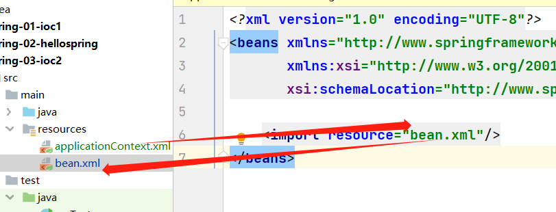
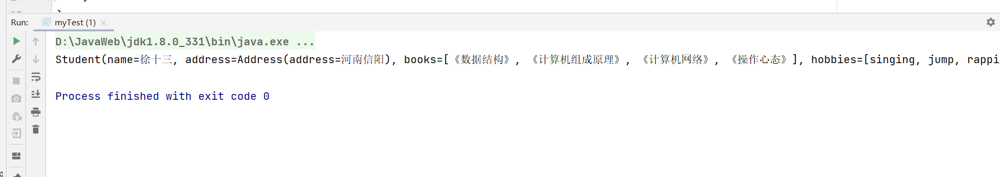

# Spring-Study

## 1.简介

spring理念：使现有的技术更加容易使用，本身是一个大杂烩。

- SSH：Struct2 + Spring + Hibernate
- SSM： SpringMVC + Spring + Mybatis

相关依赖：

  ```
    <!-- https://mvnrepository.com/artifact/org.springframework/spring-webmvc -->
    <dependency>
        <groupId>org.springframework</groupId>
        <artifactId>spring-webmvc</artifactId>
        <version>5.2.5.RELEASE</version>
    </dependency>
    
    <dependency>
        <groupId>org.springframework</groupId>
        <artifactId>spring-jdbc</artifactId>
        <version>5.2.3.RELEASE</version>
    </dependency>

```

- spring是一个开源的免费的容器
- spring是一个轻量级的，非入侵式的。
- 控制反转（IOC），面向切面编程（AOP）
- 支持事务处理，对框架整合的支持

总结：spring是一个轻量级的控制反转和面向切面编程的框架。

## 2.IOC理论

1. UserDao
2. UserDaoImpl
3. UserService
4. UserServiceImpl

在之前，用户的需求可能会影响到原来的代码。使用一个set.

```

public void setUserDao(UserDao userDao){
    this.userDao = userDao;
}
```

- 之前的是主动创建对象，控制权在程序员手上。
- 使用set注入之后，是被动接收对象。

## 3.Hello Spring

- pojo中

```
package com.shisan.pojo;

import lombok.Data;

/**
 * @Author:shisan
 * @Date:2023/10/18 20:45
 */
@Data
public class Student {
    private String name;
}
```

- bean.xml配置

```xml
<?xml version="1.0" encoding="UTF-8"?>
<beans xmlns="http://www.springframework.org/schema/beans"
       xmlns:xsi="http://www.w3.org/2001/XMLSchema-instance"
       xsi:schemaLocation="http://www.springframework.org/schema/beans
        http://www.springframework.org/schema/beans/spring-beans.xsd">
    <!--使用Spring来创建对象，这些都成为bean
     类型 变量名 = new 变量();
      id = 变量名
      class = new 的对象：
      property 相当于给对象的属性设置一个值

    -->
    <bean id="student" class="com.shisan.pojo.Student">
        <property name="name" value="十三"/>
    </bean>
</beans>

```

- StudentApplication类

```java
package com.shisan;

import com.shisan.pojo.Student;
import org.springframework.context.ApplicationContext;
import org.springframework.context.support.ClassPathXmlApplicationContext;

/**
 * @Author:shisan
 * @Date:2023/10/18 20:53
 */
public class StudentApplication {
    public static void main(String[] args) {
        // 获取spring的上下文对象
        ApplicationContext context = new ClassPathXmlApplicationContext("bean.xml");
        // 我们的对象都在spring中管理了
        Student student = (Student) context.getBean("student");
        System.out.println(student.toString());
    }
}
```

bean = 对象 id= 变量名 class = new的对象 property相当于给对象中的属性设值

**核心用set注入**

## 4.IOC创建对象的方式

1.使用无参构造创建对象，默认

```xml

<bean id="user" class="com.shisan.pojo.User">
    <property name="name" value="十三"/>
</bean>
```

2.使用有参构造

- 下标赋值

```xml
<!--第一种使用下标赋值-->
<bean id="user" class="com.shisan.pojo.User">
    <constructor-arg index="0" value="徐十三学Spring"/>
</bean>
```

- 类型赋值（不建议使用）

```xml
<!--第二种通过类型赋值 （不建议使用）-->
<bean id="user" class="com.shisan.pojo.User">
    <constructor-arg type="java.lang.String" value="徐磊"/>
</bean>
```

- 参数名赋值

```xml
<!--第三种使用参数名赋值-->
<bean id="user" class="com.shisan.pojo.User">
    <constructor-arg name="name" value="十三"/>
</bean>
```

总结：在配置文件加载的时候，容器中管理的对象就已经初始化了！！！

## 5.Spring配置

- 别名：

```xml
<!--别名，如果添加了别名，我们可以使用别名获取对象-->
<alias name="user" alias="user2"/>
```

- Bean的配置信息

1. id ：bean 的唯一标识没就是相当于学的对象名
2. class ： bean 对象所对应的全限定名： 包名 + 类名
3. name ： 也就是别名，而且name可以给取多个别名

```xml
<!--bean的配置-->
<bean id="user" class="com.shisan.pojo.User" name="user1 user2 user3 user4">
    <constructor-arg name="name" value="十三"/>
</bean>
```

- import

一般用于团队开发，它可以将多个配置文件，导入合并为一个 在applicationContext.xml中
~~~~

  ```xml

<import resource="beans.xml"/>
  ```

## 6.DI依赖注入

**构造器注入**

**set方式注入**（重点）

- 依赖：bean对象的创建依赖于容器
- 注入：bean对象中的所有属性，由容器来注入

**【环境搭建】**

1.复杂类型

2.真实测试对象

```java
package com.shisan.pojo;

import lombok.AllArgsConstructor;
import lombok.Data;
import lombok.NoArgsConstructor;

import java.util.List;
import java.util.Map;
import java.util.Properties;
import java.util.Set;

/**
 * @Author:shisan
 * @Date:2023/10/19 14:31
 */
@Data
@AllArgsConstructor
@NoArgsConstructor
public class Student {
    private String name;
    private Address address;
    private String[] books;
    private List<String> hobbies;
    private Map<String, String> card;
    private Set<String> games;
    private String wife;
    private Properties info;
}
```

```java
package com.shisan.pojo;

import lombok.Data;

/**
 * @Author:shisan
 * @Date:2023/10/19 14:31
 */
@Data
public class Address {
    private String address;
}

```

```xml
<?xml version="1.0" encoding="UTF-8"?>
<beans xmlns="http://www.springframework.org/schema/beans"
       xmlns:xsi="http://www.w3.org/2001/XMLSchema-instance"
       xsi:schemaLocation="http://www.springframework.org/schema/beans http://www.springframework.org/schema/beans/spring-beans.xsd">
    <!--普通注入-->
    <bean id="address" class="com.shisan.pojo.Address">
        <property name="address" value="河南信阳"/>
    </bean>

    <bean id="student" class="com.shisan.pojo.Student">
        <property name="name" value="徐十三"/>
        <!--Bean注入，ref-->
        <property name="address" ref="address"/>

        <!--数组-->
        <property name="books">
            <array>
                <value>《数据结构》</value>
                <value>《计算机组成原理》</value>
                <value>《计算机网络》</value>
                <value>《操作心态》</value>
            </array>
        </property>

        <!--list-->
        <property name="hobbies">
            <list>
                <value>singing</value>
                <value>jump</value>
                <value>rapping</value>
                <value>basketball</value>
            </list>
        </property>

        <!--map-->
        <property name="card">
            <map>
                <entry key="eat" value="吃排骨"></entry>
                <entry key="sleep" value="睡大觉"></entry>
            </map>
        </property>

        <!--set-->
        <property name="games">
            <set>
                <value>王者荣耀</value>
                <value>部落冲突</value>
                <value>金铲铲</value>
            </set>
        </property>

        <!--null-->
        <property name="wife">
            <null/>
        </property>

        <!--info-->
        <property name="info">
            <props>
                <prop key="学号">022300200240</prop>
                <prop key="班级">20级软件工程2班</prop>
                <prop key="性别">男</prop>
            </props>
        </property>
    </bean>


</beans>
```

```java
import com.shisan.pojo.Student;
import org.springframework.context.ApplicationContext;
import org.springframework.context.support.ClassPathXmlApplicationContext;

/**
 * @Author:shisan
 * @Date:2023/10/19 14:37
 */
public class myTest {
    public static void main(String[] args) {
        ApplicationContext context = new ClassPathXmlApplicationContext("beans.xml");
        Student student = (Student) context.getBean("student");
        System.out.println(student.toString());
    }
}

```

打印的结果

```java
/*
Student(name=徐十三, address=Address(address=河南信阳),
books=[《数据结构》, 《计算机组成原理》, 《计算机网络》, 《操作心态》],
hobbies=[singing, jump, rapping, basketball], card={eat=吃排骨, sleep=睡大觉},
games=[王者荣耀, 部落冲突, 金铲铲], wife=null,
info={学号=022300200240, 性别=男, 班级=20级软件工程2班})
 */
```


**第三方**

p命名标签和c命名标签

- 实体类User

```java
package com.shisan.pojo;

import lombok.AllArgsConstructor;
import lombok.Data;
import lombok.NoArgsConstructor;

/**
 * @Author:shisan
 * @Date:2023/10/19 15:49
 */
@Data
@AllArgsConstructor
@NoArgsConstructor
public class User {
    private String name;
    private Integer age;
}

```

- userBean.xml配置

```xml
<?xml version="1.0" encoding="UTF-8"?>
<beans xmlns="http://www.springframework.org/schema/beans"
       xmlns:xsi="http://www.w3.org/2001/XMLSchema-instance"
       xmlns:p="http://www.springframework.org/schema/p"
       xmlns:c="http://www.springframework.org/schema/c"
       xsi:schemaLocation="http://www.springframework.org/schema/beans
       http://www.springframework.org/schema/beans/spring-beans.xsd">
    <!--p命名空间注入 可以直接注入属性的值-->
    <bean id="user" class="com.shisan.pojo.User" p:name="徐磊" p:age="22"/>
    <!--c命名空间注入，通过构造器注入，construct-args -->
    <bean id="user2" class="com.shisan.pojo.User" c:name="徐十三" c:age="20"/>

</beans>
```

- 测试

```
@Test
public void userTest(){
   ApplicationContext context=new ClassPathXmlApplicationContext("userBean.xml");
   //  User user = (User) context.getBean("user");
   User user=context.getBean("user2",User.class); // 显示的声明对象类型，就不用强转
   System.out.println(user);
}
```

**注意:** p命名和c命名需要导入xml约束

```
xmlns:p="http://www.springframework.org/schema/p"
xmlns:c="http://www.springframework.org/schema/c"

```